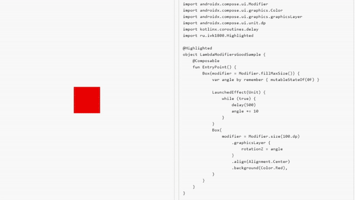

# Recomposition Visualization

**Recomposition Visualization** is an application for visually understanding how Jetpack Compose works. It allows you to track recompositions and state changes in a clear way, similar to [**RxMarbles**](https://rxmarbles.com/) and [**FlowMarbles**](https://flowmarbles.com/) for data streams.

The app is available [here](https://ivk1800.github.io/recomposition-visualization).😎

## ⚙️ Technologies

* **Kotlin**
* **Jetpack Compose Multiplatform**
* **FIR & IR API** — used for code analysis and generation at the compiler level

## 🎬 Demo



## 🚀 How to Run

### Desktop
```bash
./gradlew :composeApp:run
```
Or
```bash
./gradlew :composeApp:hotRunJvm
```

### JS Browser
```bash
./gradlew :composeApp:jsBrowserDevelopmentRun --continuous
```

### JS Browser Distribution
```bash
./gradlew buildApp
```

## 📝 Contribute Your Own Sample

You can contribute your own Compose examples to the project via **Pull Requests**. To add a new sample, follow these steps:

1. **Create a sample class**  
   In the package `ru.ivk1800.sample`, add a new class with the following structure:

    ```kotlin
    @Highlighted
    object MyAwesomeSample {
        @Composable
        fun EntryPoint() {
            // Your Compose code here
        }
    }
    ```
    The class must be annotated with `@Highlighted`. It must contain a method `EntryPoint()` marked as `@Composable`.

2. Register the sample in SampleDescriptor. Add a new enum entry for your sample:
    ```kotlin
    MyAwesome(
        id = 16,
        entryPoint = { MyAwesomeSample.EntryPoint() },
        sourceCode = { MyAwesomeSample.HighlightedSourceCode() },
        title = Res.string.my_awesome_title,
        explanation = Res.string.my_awesome_explanation,
        good = null,
    ),
    ```
   If your sample has two variants (“good” and “bad”), make sure to provide the good value.

3. Add string resources
    Add entries for the sample's title and explanation.

4. Submit a Pull Request 🏆.

## 🧱 Dependency Guard

`gradlew dependencyGuard`

`gradlew dependencyGuardBaseline`
